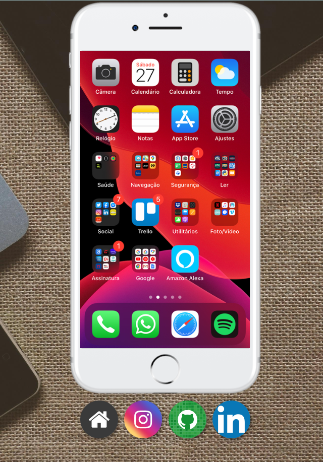

#### Páginas desenvolvidas durante atividades do Curso de HTML5 e CSS3, do professor Gustavo Guanabara, onde aprendemos:

- Conceitos de Web, Domínios e Hospedagens;
- Design;
- Mídias e Direitos Autorais;
- HTML5, CSS3 e Responsividade;
- Conceitos de Git e GitHub.

---

## Landing Page "História do Mascote do Android" (Desafio 10)

Projeto desenvolvido com HTML5 e CSS3, responsivo para Mobile, onde praticamos diversos conceitos como Âncoras, Menus, Listas e Abreviações, dentre outros.

#### Acesse Online:
[História do Mascote do Android](https://dilene-carvalho.github.io/estudos/desafio_10/)

#### Preview:

---

## Projeto Cordel

Projeto desenvolvido com HTML5 e CSS3, responsivo para Mobile, onde praticamos a estilização da página com imagens fixas de fundo (Efeito Parallax) e boas práticas no uso de sombras.

#### Acesse online:
[Projeto Cordel](https://dilene-carvalho.github.io/estudos/projeto-cordel/)

#### Preview

---

## Projeto Redes Sociais

Mini projeto desenvolvido durante estudo de iframes, onde recriamos uma  tela de dispositivo mobile com navegação entre nossas redes sociais. Também foi discutido sobre a usabilidade dos iframes e questões de segurança.

#### Acesse online:
[Projeto Redes Sociais](https://dilene-carvalho.github.io/estudos/projeto-redes-sociais/)

#### Preview

